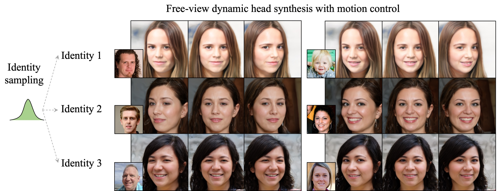
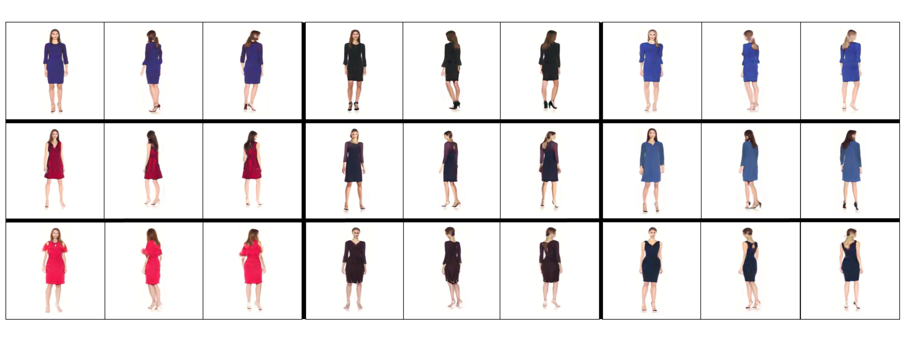

# Controllable Radiance Fields for Dynamic Face Synthesis (3DV 2022)


The official PyTorch repository for [Controllable Radiance Fields for Dynamic Face Synthesis](https://payeah.net/corf_html/index.html), 3DV 2022.

In this repository, we propose a Controllable Radiance Field (CoRF): 1) Motion control is achieved by embedding motion features within the
layered latent motion space of a style-based generator; 2) To ensure consistency of background, motion features and subject-specific attributes such as lighting, texture, shapes, albedo, and identity, a face parsing net, a head regressor and an identity encoder are incorporated. On head image/video data we show that CoRFs are 3D-aware while enabling editing of identity, viewing directions, and motion.


## Get Started 

We are cleaning code and will release it soon.

## Additional results on monocular human body RGB videos
We also verify the effacacy of CoRF on monocular human body RGB videos. In the figure below we show 9 synthetic human bodies from multiple views. 
In each row, we use different motion representations to control the standing gesture. 




## Citation

If you find our work or repo useful in your research, please consider citing our paper:

```
@inproceedings{zhuang2022controllable,
  author = {P. Zhuang and L. Ma and O. Koyejo and A.~G. Schwing},
  title = {Controllable Radiance Fields for Dynamic Face Synthesis},
  booktitle = {Proc. 3DV},
  year = {2022},
}
```
